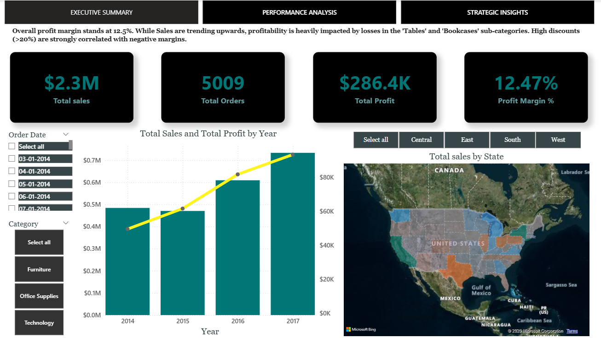
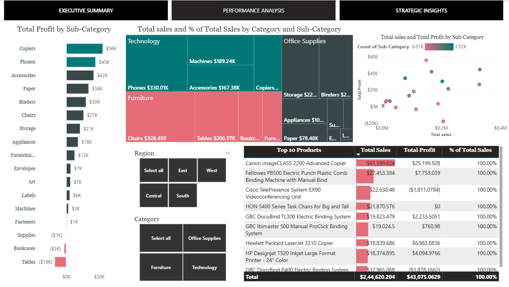
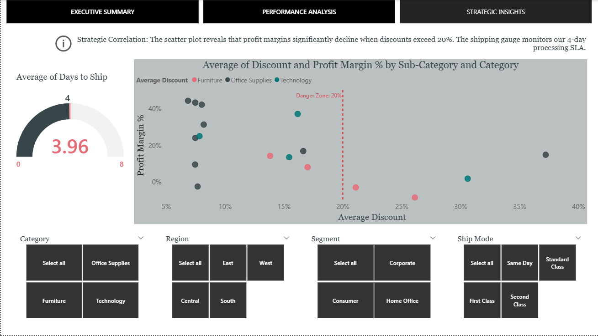

# FUTURE_DS_01
Data Analytics Task 1 - Business Sales Performance Analysis
# Project Overview
This project was developed as part of the Future Interns Data Science & Analytics Internship. The goal was to perform a comprehensive analysis of the "Sample - Superstore" dataset to identify key revenue drivers, assess profitability, and provide strategic recommendations for business growth.
Interactive 3-page Power BI dashboard for Future Interns Task 1. Analyzing Superstore sales performance, sub-category profitability, and the strategic correlation between high discounts and margin loss.
## Dashboard Preview

### 📊 Page 1: Executive Summary
Provides a high-level overview of global performance and key metrics.

### 📈 Page 2: Performance Analysis
A deep-dive into sub-category trends and top-performing products.

### 💡 Page 3: Strategic Insights
Analysis of shipping efficiency and the correlation between discounts and profit margins.

## Key Business Insights
After analyzing the data, the following critical insights were identified:
Profitability: The overall profit margin stands at 12.5%. While sales are trending upwards, profitability is heavily impacted by specific losses.
Underperforming Categories: The 'Tables' and 'Bookcases' sub-categories are currently operating at a loss despite high sales volume.
The Discount Effect: There is a strong negative correlation between high discounts and margin. Discounts exceeding 20% are consistently linked to negative profit margins.
Shipping Efficiency: The average time to ship is 3.96 days, successfully meeting the corporate SLA target of under 4 days.

## Tools & Technologies Used
Power BI Desktop: For data visualization and dashboard design.
DAX (Data Analysis Expressions): Created custom measures for Profit Margin, Total Orders, and Average Shipping Days.
Power Query: Used for data cleaning and transformation.
GitHub: For version control and project documentation.

## Repository Structure
Data: Contains the raw Superstore dataset used for the analysis.
Dashboard: Contains the .pbix file for interactive viewing.
Images: High-resolution screenshots of the dashboard pages.

# How to View
Download the .pbix file from the /Dashboard folder.
Open it using Power BI Desktop.
Use the slicers on each page to filter data by Region, Category, and Year.
